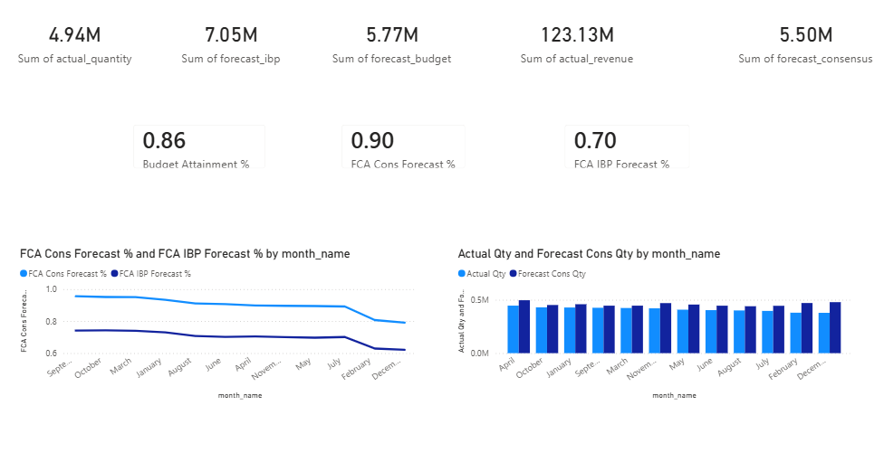
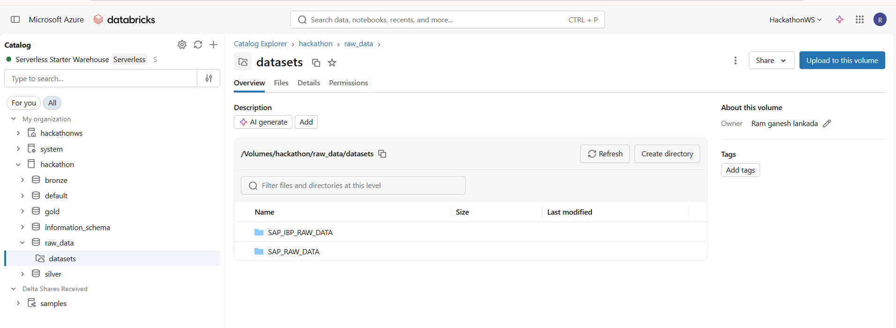
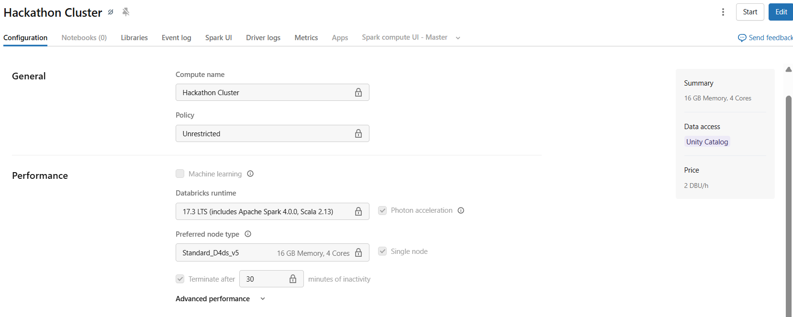
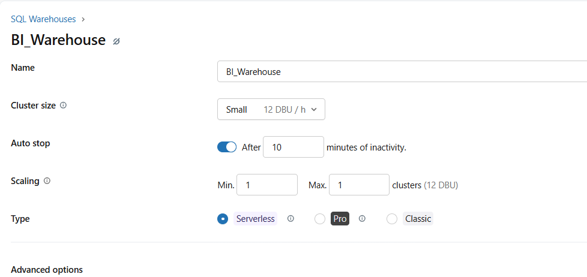

# Enterprise Supply Chain Analytics Platform

## Dashboard

---

## Project Overview

This project delivers an end-to-end supply chain analytics solution built on the Medallion architecture. It transforms raw SAP ERP and SAP IBP data into governed, analytics-ready insights for executive decision-making using Databricks and Power BI.

The platform emphasizes scalability, data quality, lineage, and semantic modeling best practices.

---

## Architecture Summary

**Data Flow**

SAP ERP & IBP → Bronze → Silver → Gold → Power BI

* **Bronze** preserves raw data
* **Silver** standardizes and cleans
* **Gold** models business-ready facts and dimensions
* **BI** delivers executive dashboards

---

## 1. Gold Layer — Medallion Architecture

**Objective:** Demonstrate the structured Medallion flow and Gold readiness.

**Highlights**

* Bronze raw ingestion
* Silver standardized layer
* Gold galaxy schema
* Optimized for BI consumption

---

## 2. Compute Infrastructure

**Objective:** Showcase the scalable compute backbone.

**Highlights**

* Distributed Databricks compute
* Auto-scaling clusters
* Delta Lake optimization
* Handles large SAP workloads

### All-Purpose Cluster (Hackathon Cluster) — DE Workloads

### SQL Warehouse (BI_Warehouse) — BI Workloads

---

## 3. Medallion Lineage — Facts & Dimensions

**Objective:** Provide end-to-end traceability from raw ingestion to business model.

**Highlights**

* Bronze ingestion lineage
* Silver standardization
* Gold conformed facts and dimensions
* Full pipeline traceability

### Dimension Tables Lineage

### Fact Tables Lineage

---

## 4. Power BI Semantic Model & KPIs

**Objective:** Deliver executive-ready analytics through a governed semantic layer.

**Flow**

ER Diagram → KPI Measures → Executive Dashboard

**Key KPIs**

* Forecast Accuracy (FCA)
* Budget Attainment
* Demand performance tracking

### Model View (ER Diagram)

### Executive KPI Dashboard

---

## Business Impact

This platform enables:

* Accurate forecast performance measurement
* Budget visibility across the supply chain
* Cross-functional analytics
* Scalable enterprise data foundation
* Governed, production-ready BI

---

## Conclusion

The Medallion-based pipeline converts raw SAP and IBP data into a scalable, governed supply chain analytics platform that delivers reliable, executive-grade insights.
